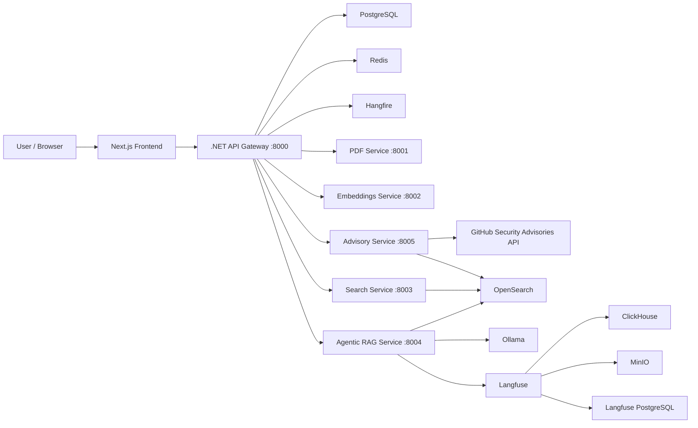

# CyberGuard AI

An agentic RAG platform for security advisory intelligence, vulnerability search, PDF analysis, and operational monitoring.

CyberGuard AI combines a .NET API gateway, Python AI microservices, OpenSearch hybrid retrieval, local Ollama generation, Hangfire background jobs, Langfuse observability, and a Next.js dashboard into one deployable security intelligence system.

It is designed for teams and builders who want to ingest GitHub Security Advisories, index them for semantic and keyword search, ask natural-language questions over the indexed corpus, upload their own PDFs, and inspect advisory trends from a web interface.

> This repository started from an educational RAG codebase, but has evolved into a security-focused, multi-service application. The old course README has intentionally been replaced with this project README.

## Contents

- [Features](#features)
- [Architecture](#architecture)
- [Tech Stack](#tech-stack)
- [Repository Structure](#repository-structure)
- [Prerequisites](#prerequisites)
- [Quick Start](#quick-start)
- [Environment Configuration](#environment-configuration)
- [Running The Frontend](#running-the-frontend)
- [First Run Checklist](#first-run-checklist)
- [API Overview](#api-overview)
- [Advisory Ingestion](#advisory-ingestion)
- [Background Jobs](#background-jobs)
- [Observability](#observability)
- [Deployment Notes](#deployment-notes)
- [Development Workflow](#development-workflow)
- [Security Notes](#security-notes)
- [Troubleshooting](#troubleshooting)
- [Roadmap](#roadmap)
- [Contributing](#contributing)
- [License](#license)

## Features

- GitHub Security Advisory ingestion with filtering by severity, ecosystem, and modified date.
- Hybrid retrieval over advisory and document chunks using BM25 plus vector search.
- Agentic RAG workflow with guardrails, retrieval routing, document grading, query rewriting, and answer generation.
- Local LLM inference through Ollama.
- Jina AI embeddings for semantic search.
- User authentication with JWT access/refresh tokens.
- Optional Google and GitHub OAuth login.
- PDF upload, parsing, storage, indexing, and chat over uploaded documents.
- Next.js dashboard for advisory statistics, incident-style views, search, analytics, admin, and chat.
- Hangfire recurring jobs for scheduled advisory ingestion.
- Langfuse tracing for RAG observability.
- Redis caching.
- PostgreSQL persistence with EF Core migrations.
- OpenSearch Dashboards for search/index inspection.
- Docker Compose deployment for backend, Python services, databases, search, observability, and LLM infrastructure.

## Architecture



### Request Flow

1. The frontend calls the .NET API Gateway.
2. The .NET API handles auth, users, uploads, admin APIs, database writes, and orchestration.
3. Python microservices perform AI-heavy work: parsing, embeddings, search, advisory fetching, indexing, and agentic RAG.
4. OpenSearch stores searchable document/advisory chunks.
5. Ollama generates local LLM responses.
6. Langfuse records traces and observability data.
7. Hangfire schedules recurring advisory ingestion.

## Tech Stack

| Layer | Technology |
| --- | --- |
| Frontend | Next.js 14, React 18, TypeScript, Tailwind CSS, TanStack Query |
| API Gateway | ASP.NET Core / .NET 8, EF Core, JWT auth, Swagger |
| Background Jobs | Hangfire with PostgreSQL storage |
| AI Services | FastAPI, LangGraph, LangChain, Ollama |
| Embeddings | Jina AI embeddings |
| Search | OpenSearch 2.19, BM25, vector search, hybrid retrieval |
| Database | PostgreSQL |
| Cache | Redis |
| Observability | Langfuse v3, ClickHouse, MinIO |
| Document Processing | Docling PDF parsing |
| Packaging | Docker Compose, uv, npm |

## Repository Structure

```text
.
|-- backend/                         # .NET solution
|   `-- src/
|       |-- RagSystem.ApiGateway/     # Controllers, auth, Hangfire, startup
|       |-- RagSystem.Core/           # DTOs, entities, interfaces
|       `-- RagSystem.Infrastructure/ # EF Core, repositories, service clients
|-- frontend/                         # Next.js application
|   `-- src/
|       |-- app/                      # App router pages
|       |-- components/               # Dashboard and layout components
|       |-- hooks/                    # Streaming and UI hooks
|       `-- stores/                   # Auth/theme stores
|-- services/                         # Thin service Docker entry points
|   |-- advisory_service/
|   |-- agentic_rag_service/
|   |-- embeddings_service/
|   |-- pdf_service/
|   `-- search_service/
|-- src/                              # Shared Python application modules
|   |-- routers/                      # FastAPI routers
|   |-- services/                     # GitHub, OpenSearch, RAG, Langfuse, etc.
|   |-- schemas/
|   `-- db/
|-- scripts/                          # Utility scripts
|-- migrations/                       # SQL helpers
|-- Dockerfile                        # .NET API Dockerfile
|-- docker-compose.yml                # Main backend/infrastructure stack
|-- pyproject.toml                    # Python dependencies
|-- uv.lock
`-- .env.example
```

## Prerequisites

For local development:

- Docker and Docker Compose
- Python 3.12
- uv
- .NET 8 SDK
- Node.js 20+
- npm

For production-style deployment:

- Linux VM with at least 4 vCPU, 12 GB RAM, and 80 GB disk
- Docker Engine with Compose plugin
- A real `JINA_API_KEY`
- A GitHub token for advisory ingestion
- Strong generated secrets for JWT and Langfuse

## Quick Start

Clone the repository:

```bash
git clone <your-repo-url>
cd AgenticRAG
```

Create your environment file:

```bash
cp .env.example .env
```

Edit `.env` and set at least:

```env
ENVIRONMENT=Production
JWT_SECRET_KEY=replace-with-a-long-random-secret
JINA_API_KEY=your-jina-api-key
GITHUB_TOKEN=your-github-token
GITHUB__API_TOKEN=your-github-token
LANGFUSE_ENCRYPTION_KEY=replace-with-output-of-openssl-rand-hex-32
LANGFUSE_NEXTAUTH_SECRET=replace-with-random-secret
LANGFUSE_SALT=replace-with-random-secret
```

Generate safe secrets:

```bash
openssl rand -base64 48  # JWT_SECRET_KEY
openssl rand -hex 32     # LANGFUSE_ENCRYPTION_KEY
openssl rand -base64 32  # LANGFUSE_NEXTAUTH_SECRET
openssl rand -base64 32  # LANGFUSE_SALT
```

Start the backend and infrastructure stack:

```bash
docker compose up -d --build
```

Pull the Ollama model:

```bash
docker compose exec ollama ollama pull llama3.2:1b
```

Check health:

```bash
docker compose ps
curl http://localhost:8000/health
curl http://localhost:3001/api/public/health
```

Open the API docs:

```text
http://localhost:8000/swagger
```

## Environment Configuration

Never commit `.env`. It contains real secrets and local deployment URLs.

Important variables:

| Variable | Required | Purpose |
| --- | --- | --- |
| `ENVIRONMENT` | Yes | `Production` for Docker deployment |
| `JWT_SECRET_KEY` | Yes | Signs access and refresh tokens |
| `JINA_API_KEY` | Yes | Generates embeddings |
| `GITHUB_TOKEN` | Recommended | Raises GitHub advisory API rate limits |
| `GITHUB__API_TOKEN` | Recommended | Python settings equivalent for GitHub token |
| `OPENSEARCH__HOST` | Yes | OpenSearch host inside Compose |
| `OLLAMA_HOST` | Yes | Ollama host inside Compose |
| `OLLAMA_MODEL` | Yes | Local model name, default `llama3.2:1b` |
| `LANGFUSE_ENABLED` | Optional | Enables Python tracing |
| `LANGFUSE_PUBLIC_KEY` | Optional | Langfuse project public key |
| `LANGFUSE_SECRET_KEY` | Optional | Langfuse project secret key |
| `LANGFUSE_ENCRYPTION_KEY` | Yes for Langfuse | Must be 64 hex characters |
| `LANGFUSE_NEXTAUTH_SECRET` | Yes for Langfuse | Auth/session secret |
| `LANGFUSE_SALT` | Yes for Langfuse | Langfuse salt |
| `LANGFUSE_REDIS_PASSWORD` | Yes for Langfuse | Password for Langfuse Redis |
| `LANGFUSE_MINIO_ACCESS_KEY` | Yes for Langfuse | MinIO access key |
| `LANGFUSE_MINIO_SECRET_KEY` | Yes for Langfuse | MinIO secret key |
| `FRONTEND_PUBLIC_URL` | Recommended | Used for OAuth redirect back to frontend |
| `API_PUBLIC_URL` | Recommended | Public API URL for docs/deployment |
| `GOOGLE_OAUTH_CLIENT_ID` | Optional | Google OAuth login |
| `GOOGLE_OAUTH_CLIENT_SECRET` | Optional | Google OAuth login |
| `GITHUB_OAUTH_CLIENT_ID` | Optional | GitHub OAuth login |
| `GITHUB_OAUTH_CLIENT_SECRET` | Optional | GitHub OAuth login |
| `TELEGRAM__ENABLED` | Optional | Enables Telegram bot integration |
| `TELEGRAM__BOT_TOKEN` | Optional | Telegram bot token |

OAuth callback URLs:

```text
Google: {API_PUBLIC_URL}/api/auth/oauth/google/callback
GitHub: {API_PUBLIC_URL}/api/auth/oauth/github/callback
```

For local development, use:

```text
http://localhost:8000/api/auth/oauth/google/callback
http://localhost:8000/api/auth/oauth/github/callback
```

## Running The Frontend

The main Docker Compose file runs the backend and infrastructure stack. The frontend is run separately.

Create `frontend/.env.local`:

```env
NEXT_PUBLIC_API_BASE_URL=http://localhost:8000
NEXT_PUBLIC_DEMO_MODE=false
```

Run the frontend:

```bash
cd frontend
npm ci
npm run dev
```

Open:

```text
http://localhost:3000
```

For production:

```bash
cd frontend
npm ci
npm run build
npm run start -- -p 3000
```

If you change `NEXT_PUBLIC_API_BASE_URL`, rebuild the frontend. Next.js embeds `NEXT_PUBLIC_*` variables at build time.

## First Run Checklist

1. Copy `.env.example` to `.env`.
2. Replace all placeholder secrets.
3. Set `JINA_API_KEY`.
4. Set `GITHUB_TOKEN` and `GITHUB__API_TOKEN`.
5. Start Compose with `docker compose up -d --build`.
6. Pull the Ollama model.
7. Check `http://localhost:8000/health`.
8. Register the first user.
9. Promote the first user to admin if you need admin pages and job controls.
10. Ingest a small advisory batch before running large backfills.

Promote a user to admin:

```bash
docker compose exec postgres psql -U postgres -d rag_system \
  -c "update dotnet_app.users set \"Role\" = 'admin' where \"Email\" = 'you@example.com';"
```

## API Overview

The public entry point is the .NET API Gateway on port `8000`.

| Area | Endpoint | Auth | Description |
| --- | --- | --- | --- |
| Health | `GET /health` | No | API, database, and Redis health |
| Swagger | `GET /swagger` | No | Interactive API documentation |
| Auth | `POST /api/auth/register` | No | Create account |
| Auth | `POST /api/auth/login` | No | Password login |
| Auth | `POST /api/auth/refresh` | No | Refresh token |
| Auth | `GET /api/auth/me` | Yes | Current user |
| OAuth | `GET /api/auth/oauth/{provider}` | No | Start OAuth flow |
| Search | `POST /api/search/hybrid` | Yes | Hybrid search |
| Search | `POST /api/search/bm25` | Yes | Keyword search |
| Search | `POST /api/search/vector` | Yes | Vector search |
| RAG | `POST /api/rag/ask` | Yes | Non-streaming RAG |
| RAG | `POST /api/rag/ask-agentic` | Yes | Agentic RAG |
| RAG | `POST /api/rag/ask-stream` | Yes | SSE streaming RAG |
| Uploads | `POST /api/upload` | Yes | Upload PDF |
| Uploads | `GET /api/upload` | Yes | List uploads |
| Uploads | `GET /api/upload/{id}` | Yes | Upload status |
| Uploads | `POST /api/upload/{id}/process` | Yes | Process uploaded PDF |
| Uploads | `DELETE /api/upload/{id}` | Yes | Delete upload |
| Advisories | `GET /api/advisories` | No | List advisories |
| Advisories | `GET /api/advisories/stats` | No | Advisory stats |
| Advisories | `GET /api/advisories/{ghsaId}` | Yes | Advisory detail |
| Advisories | `POST /api/advisories/ingest` | Yes | Fetch and index advisories |
| Advisories | `POST /api/advisories/ask` | Yes | Advisory-specific question |
| Advisories | `POST /api/advisories/reindex` | Yes | Re-index advisories |
| Admin | `GET /api/admin/stats` | Admin | System stats |
| Admin | `GET /api/admin/users` | Admin | User management |
| Jobs | `GET /api/jobs/status` | Admin | Hangfire job status |
| Jobs | `POST /api/jobs/advisory-ingestion/trigger` | Admin | Trigger advisory job |
| Analytics | `GET /api/analytics/*` | Admin | Query/advisory analytics |

Python services are internal implementation services. They are not meant to be called directly from browsers.

## Advisory Ingestion

Manual ingestion:

```bash
curl -X POST http://localhost:8000/api/advisories/ingest \
  -H "Authorization: Bearer YOUR_ACCESS_TOKEN" \
  -H "Content-Type: application/json" \
  -d '{
    "maxResults": 25,
    "severity": "high",
    "ecosystem": "npm",
    "indexToOpenSearch": true
  }'
```

Start small. Once the pipeline is healthy, increase `maxResults`.

Check advisory stats:

```bash
curl http://localhost:8000/api/advisories/stats
```

Re-index existing advisories:

```bash
curl -X POST http://localhost:8000/api/advisories/reindex \
  -H "Authorization: Bearer YOUR_ACCESS_TOKEN" \
  -H "Content-Type: application/json" \
  -d '{ "unindexedOnly": false }'
```

## Background Jobs

Hangfire is used for scheduled advisory ingestion.

- Dashboard: `http://localhost:8000/hangfire`
- Recurring job ID: `advisory-ingestion`
- Default schedule: daily at `06:00 UTC`
- Manual trigger: `POST /api/jobs/advisory-ingestion/trigger`

Important: do not expose the Hangfire dashboard publicly without reverse-proxy auth, VPN, or an allowlist.

## Observability

Langfuse runs on:

```text
http://localhost:3001
```

Default local init values are configured in `docker-compose.yml`, but production deployments should change:

- `LANGFUSE_NEXTAUTH_SECRET`
- `LANGFUSE_SALT`
- `LANGFUSE_ENCRYPTION_KEY`
- `LANGFUSE_REDIS_PASSWORD`
- `LANGFUSE_MINIO_SECRET_KEY`
- `LANGFUSE_INIT_USER_PASSWORD` if you expose the service

OpenSearch Dashboards runs on:

```text
http://localhost:5601
```

Use it for index debugging, not as a public endpoint.

## Deployment Notes

For a personal VM:

1. Install Docker and Docker Compose.
2. Clone the repository.
3. Create `.env` from `.env.example`.
4. Generate strong secrets.
5. Start with `docker compose up -d --build`.
6. Pull the Ollama model.
7. Run the frontend separately with Node/PM2 or add your own frontend container.
8. Put Nginx or Caddy in front of public services.
9. Keep database, Redis, OpenSearch, ClickHouse, and raw admin dashboards private.

Recommended public routes:

| Public URL | Internal target |
| --- | --- |
| `https://your-domain.com` | `localhost:3000` frontend |
| `https://api.your-domain.com` | `localhost:8000` API |
| `https://langfuse.your-domain.com` | `localhost:3001` Langfuse, optional |

Recommended firewall:

- Allow SSH.
- Allow `80` and `443` if using a reverse proxy.
- Avoid exposing `5432`, `6379`, `9200`, `8123`, and internal service ports.

## Development Workflow

Install Python dependencies:

```bash
uv sync
```

Run the full backend/infrastructure stack:

```bash
docker compose up -d --build
```

Build the .NET solution:

```bash
dotnet build backend/RagSystem.sln
```

Run backend tests when available:

```bash
dotnet test backend/RagSystem.sln
```

Run Python checks:

```bash
uv run ruff check src
uv run mypy src
uv run pytest
```

Run frontend:

```bash
cd frontend
npm ci
npm run dev
```

Build frontend:

```bash
cd frontend
npm run build
```

Useful Docker commands:

```bash
docker compose ps
docker compose logs -f dotnet-api
docker compose logs -f advisory-service
docker compose logs -f langfuse-web
docker compose down
docker compose down -v  # destructive: removes volumes
```

## Security Notes

Before open-sourcing or deploying:

- Do not commit `.env`.
- Rotate any credentials that were ever committed or shared.
- Use a strong `JWT_SECRET_KEY`.
- Generate `LANGFUSE_ENCRYPTION_KEY` with `openssl rand -hex 32`.
- Replace default Langfuse init password if Langfuse is reachable from the internet.
- Do not expose `/hangfire` publicly without protection.
- Do not expose PostgreSQL, Redis, OpenSearch, ClickHouse, or MinIO admin ports publicly.
- Use HTTPS for OAuth callbacks in production.
- Treat uploaded PDFs as untrusted input.

The checked-in `appsettings*.json` files intentionally contain blank OAuth client values. Provide OAuth credentials through environment variables.

## Troubleshooting

### `rag-langfuse-web` is unhealthy

Check logs:

```bash
docker compose logs --tail=200 langfuse-web
docker compose logs --tail=200 clickhouse
```

Common causes:

- `LANGFUSE_ENCRYPTION_KEY` is not 64 hex characters.
- VM memory is too low.
- ClickHouse is still starting.
- Existing Langfuse volumes were initialized with different secrets.

### `.NET API` is unhealthy

Check:

```bash
docker compose logs --tail=200 dotnet-api
docker compose logs --tail=200 postgres
docker compose logs --tail=200 redis
```

Common causes:

- PostgreSQL is not healthy.
- EF Core migrations failed.
- Redis is unreachable.
- `JWT_SECRET_KEY` is missing.

### Advisories are not indexing

Check:

```bash
docker compose logs --tail=200 advisory-service
docker compose logs --tail=200 search-service
docker compose logs --tail=200 opensearch
```

Common causes:

- `GITHUB_TOKEN` is missing or rate-limited.
- `JINA_API_KEY` is missing.
- OpenSearch is unhealthy.
- The Ollama model has not been pulled.

### Frontend calls `localhost:8000` in production

Set the frontend API base URL and rebuild:

```env
NEXT_PUBLIC_API_BASE_URL=https://api.your-domain.com
```

```bash
cd frontend
npm run build
npm run start -- -p 3000
```

## Roadmap

- Add a production frontend Dockerfile and Compose service.
- Add end-to-end test coverage for the full ingestion and RAG workflow.
- Add role-protected Hangfire dashboard authorization.
- Add first-run admin bootstrap command.
- Add managed object storage support for uploaded PDFs.
- Add CI workflows for .NET, Python, and frontend checks.
- Add screenshots and architecture diagrams from the running application.

## Contributing

Contributions are welcome.

Suggested workflow:

1. Fork the repository.
2. Create a feature branch.
3. Keep changes scoped and documented.
4. Run relevant checks before opening a pull request.
5. Include screenshots for frontend changes.
6. Include migration notes for database changes.

Good first contribution areas:

- Documentation polish.
- Frontend Dockerization.
- Tests around advisory ingestion and re-indexing.
- Deployment examples for Nginx/Caddy.
- Smaller UI fixes and dashboard states.

## License

This project is licensed under the MIT License. See [LICENSE](LICENSE).

If you are publishing your fork as a new open-source project, update the copyright notice in `LICENSE` to match your ownership.
